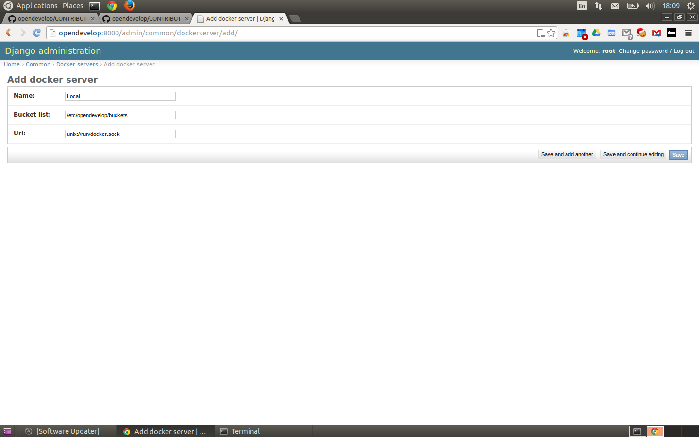
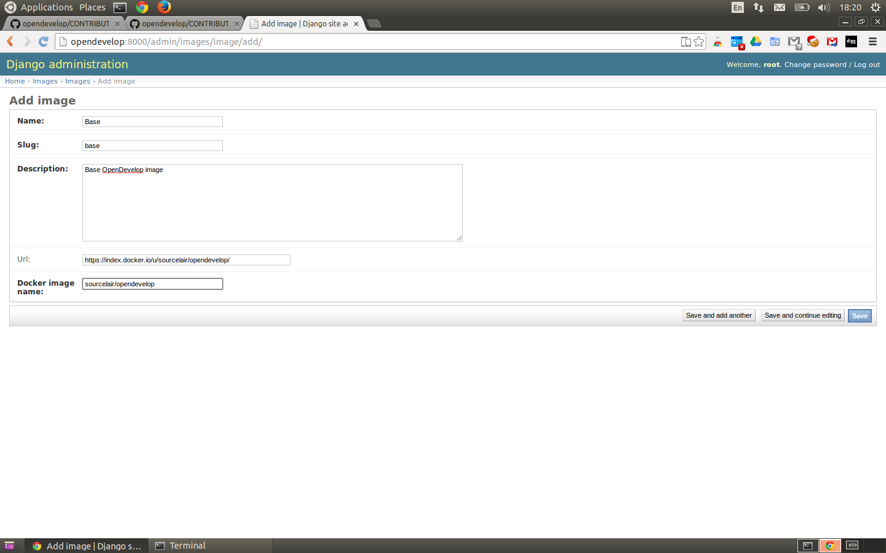

Opendevelop Private Installation
^^^^^^^^^^^^^^^^^^^^^^^^^^^^^^^^

You can easily build a private installation of Opendevelop and give your
users the chance to run code in the cloud.

Opendevelop is a Django project which dispatches the requests to the docker
servers. So an opendevelop installation should have one web server and multiple
docker servers.

Install
=======

At first you should clone the Opendevelop public repository.

.. code-block:: bash

    git clone git@github.com:sourceLair/opendevelop.git

Next thing to do is run the install script as a root user from the root directory of opendevelop.

.. code-block:: bash

    sudo python installer.py

Starting the service
---------
In order to get OpenDevelop up and running you need to start the *Celery* and the *Django server* from the
command line, from within the manage.py directory, in two different Bash sessions.

.. code-block:: bash

    ./manage.py runserver 127.0.0.0:8000

.. code-block:: bash

    celery worker -c 1 --app=tasks.app --autoreload -l DEBUG
DockerServer
------------

Management
===========

Opendevelop makes use of the
`Django Admin Panel <https://docs.djangoproject.com/en/dev/ref/contrib/admin/>`_
. So the addition of a new App, a new DockerServer or a new Image is done through
the admin panel.

Adding a DockerServer
----------------------

OpenDevelop relies on Docker to run code in its sandboxes, so in order to get OpenDevelop working, at least
one Docker Server is required. To add a new Docker Server go the Django administration panel of your
OpenDevelop installation (<opendevelop-host>:<opendevelop-port>/admin/), and click on the *+ Add* icon,
next to *Docker Servers* row of the *Common* app. The default URL for the Docker server is the local Unix domain
socket, to which Docker listens, while the default path for its buckets is the one that OpenDevelop creates on
its installation.

Adding an Image
----------------

Each OpenDevelop image corresponds to a specific Docker image. To add a new Image go the Django administration panel of your
OpenDevelop installation (<opendevelop-host>:<opendevelop-port>/admin/), and click on the *+ Add* icon,
next to *Images* row of the *Images* app. For each image its Name, Slug, Description and Docker image name have to be supplied.
Optionally a URL of the image to the Docker public index can be supplied.

Adding an App
-------------
.. image:: images/add-app.png
    :target: _images/add-app.png
    :scale: 20 %
